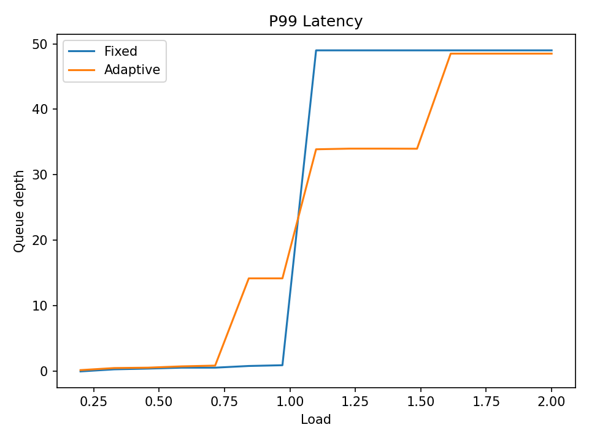
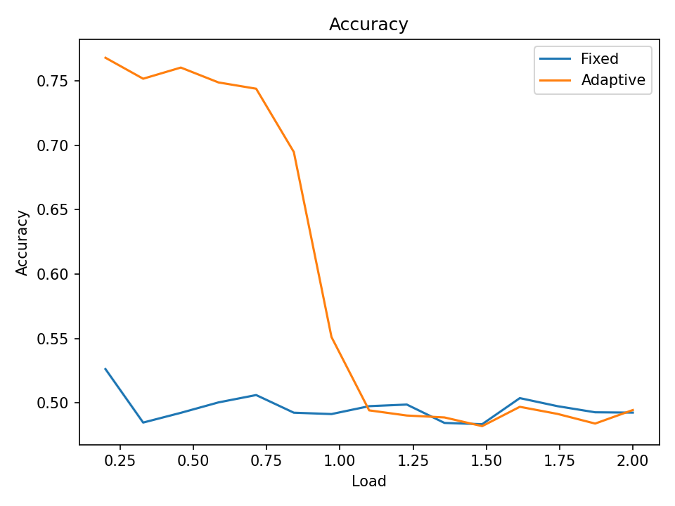

# FPGA Hardware-Aware Adaptive Anomaly Detection

[](https://opensource.org/licenses/MIT)
[](https://www.python.org/downloads/)
[](#)

> **Note:** This repository currently contains the **Software Baseline & Golden Reference Model** (Python) for evaluating the algorithmic and systemic benefits of the adaptive thresholding technique before hardware deployment on FPGA.

## 1. Motivation
Real-time anomaly detection systems deployed on embedded or FPGA platforms must balance detection sensitivity and computational latency. However, most existing approaches assume fixed decision thresholds independent of hardware resource conditions. In practice, system load fluctuates, and static thresholds can lead to unstable latency or unnecessary computation.

This project turns anomaly detection from a static algorithm into a system-aware decision process that adapts to real-time hardware conditions.

## 2. Problem Statement
We investigate how anomaly detection systems can maintain bounded inference latency under resource constraints while preserving detection accuracy.

**Core Question:** *How can anomaly decision policies adapt to real-time hardware state to stabilize runtime behavior?*

## 3. Proposed Idea
We propose a hardware-aware anomaly detection framework in which the decision threshold dynamically adjusts according to system load.

Instead of a static threshold (**`score > T`**), we utilize a dynamic, state-dependent threshold:
<div align="center">
  <b><code>score > f(system_state)</code></b>
</div>

Where `system_state` monitoring may include:
* Inference queue depth (primarily evaluated in this software baseline)
* Compute utilization
* Power level

## 4. System Architecture (End Goal)

**Complete Pipeline:**
`Sensor board -> FPGA acquisition -> feature extraction -> neural inference -> adaptive threshold -> decision`

**Target Hardware Components:**
* **Custom sensing board:** Current/power sensing front-end, digital interface to FPGA.
* **FPGA Modules:** 
    * Data acquisition controller
    * Lightweight neural network inference core
    * System load monitor
    * Adaptive threshold controller

## 5. Software Baseline & Results

The current Python code simulates queue load and evaluates the latency-accuracy trade-offs between fixed threshold detection and our proposed adaptive threshold detection under stress tests.

### 5.1 Installation & Run

```powershell
# 1) Create / use virtual environment
python -m venv .venv
& .\.venv\Scripts\Activate.ps1

# 2) Install dependencies
python -m pip install --upgrade pip
python -m pip install -r requirements.txt

# 3) Run baseline experiment
python baseline_adaptive_nn.py
```

### 5.2 Baseline Experimental Results

The scripts generate metrics comparing the **Adaptive Threshold** vs. **Fixed Threshold** under various simulated queue load conditions. 

**(1) P99 Latency Control**  
*The adaptive method effectively bounds the worst-case (P99) latency under high load spikes.*



**(2) Detection Accuracy Trade-off**  
*Achieves strict latency bounds with graceful and controlled degradation in accuracy.*



## 6. Expected Contributions & Outcome
* **Hardware-aware anomaly decision mechanism:** Re-thinking inference under constrained compute.
* **Real-time bounded-latency inference pipeline:** Guaranteeing max response limits.
* **Empirical evaluation of latency¨Caccuracy trade-offs:** Validated first via this Python baseline model.
* **End-to-end FPGA prototype:** With physical sensing interfaces (Target Outcome).

The final objective is a working real-time hardware prototype and experimental results suitable for submission to an FPGA / embedded systems venue.
